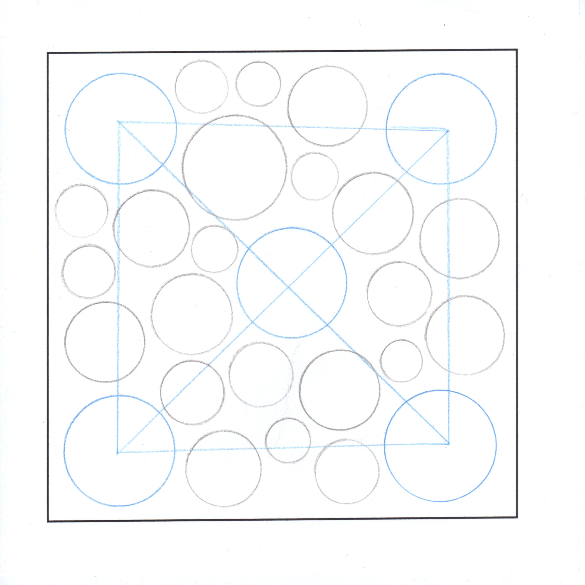
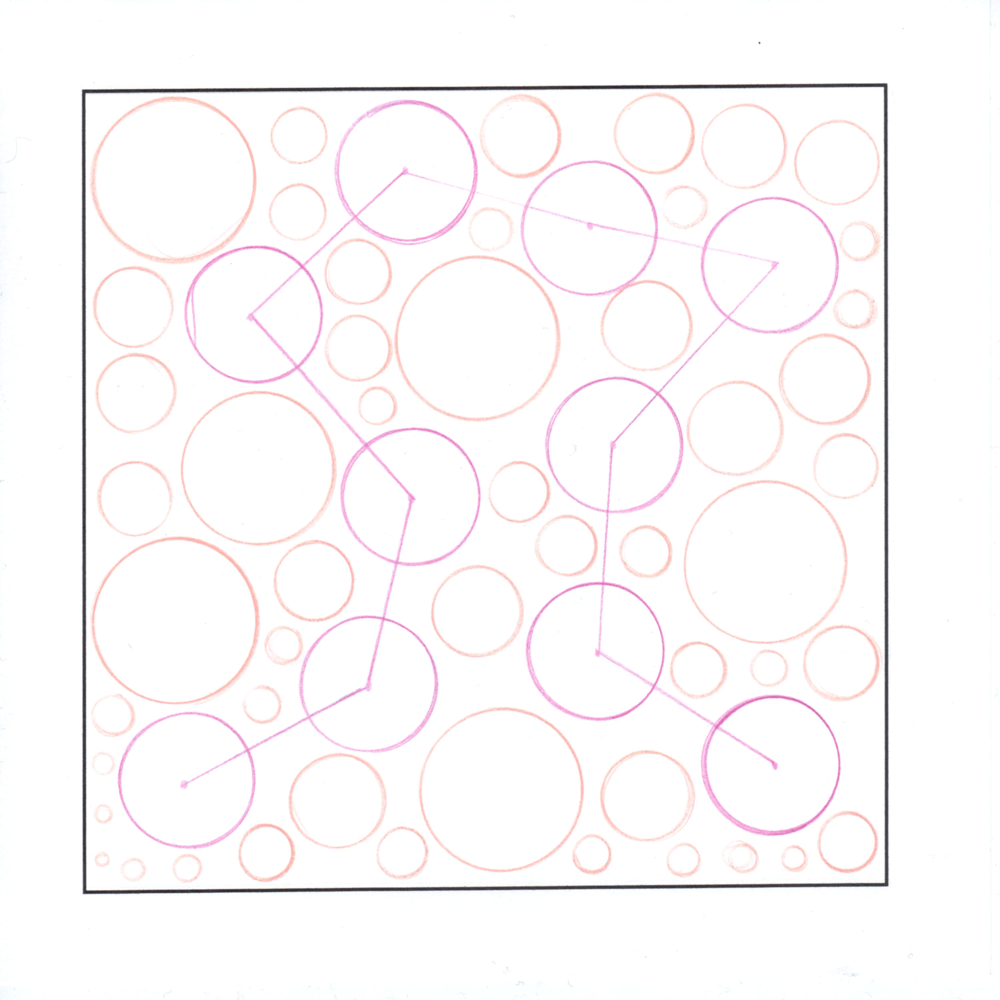
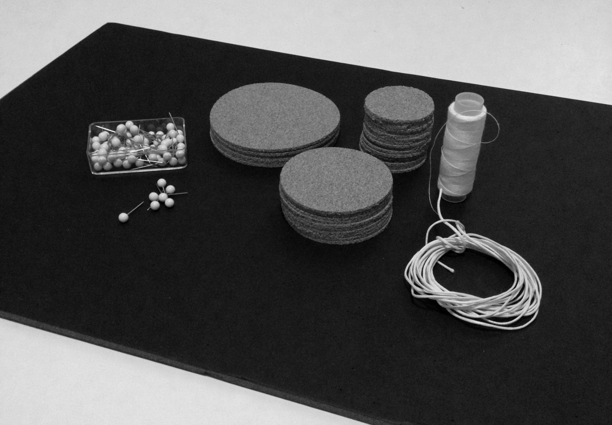
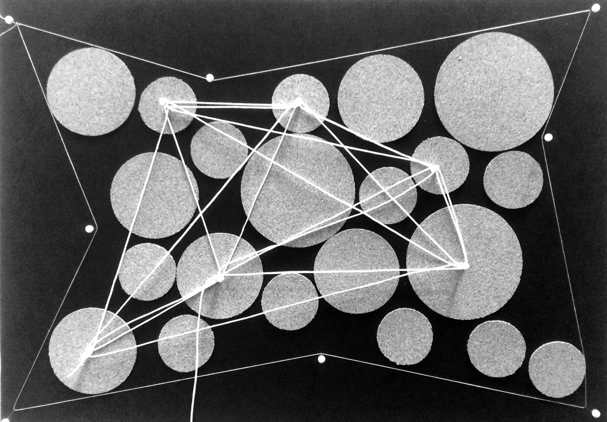
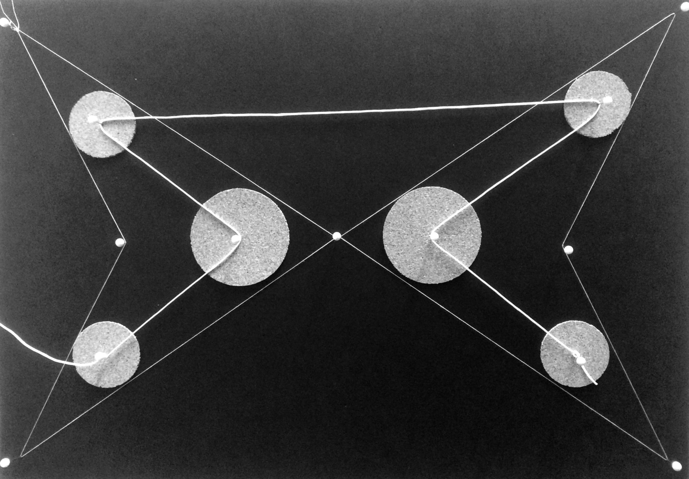
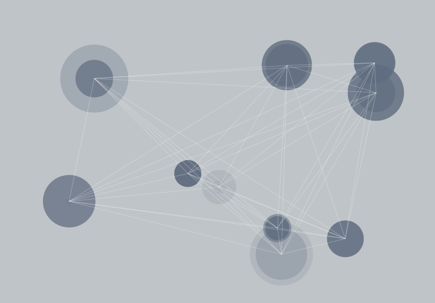
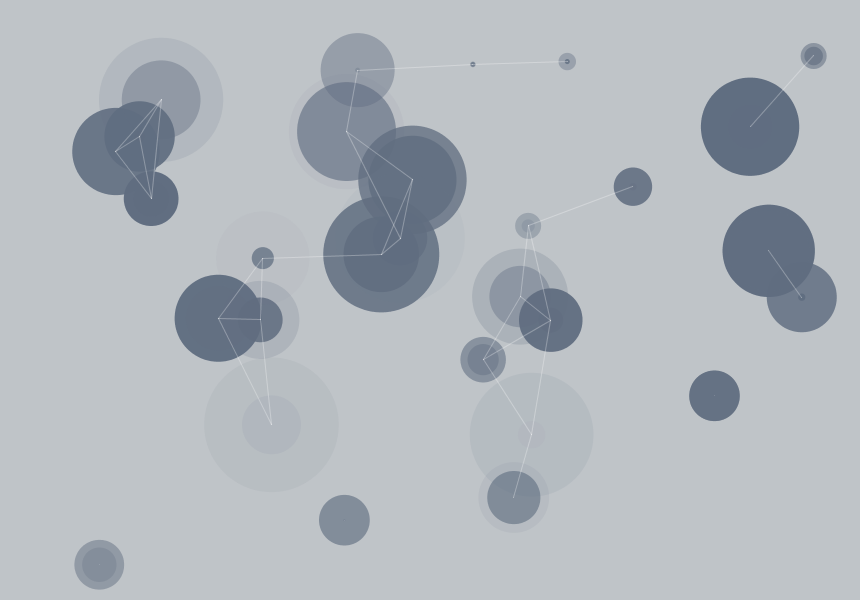
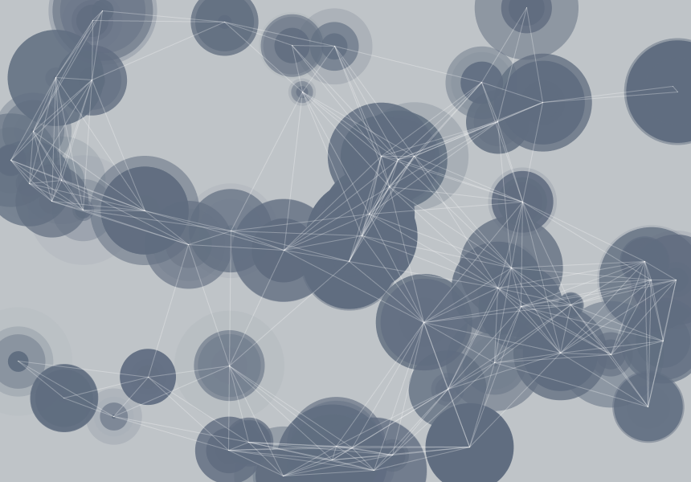

#Project Algorithm

***First confrontation and encounter with algorithm. Initially in an analoge form and afterwards into digital conversion by Processing.***

##Analog

For the first confrontation with an algorithm, the task was to think of a self-generated algorithm in human langauage. The focus was strongly on the accuracy of the statement in order to achieve the desired result. To produce more variants, it was important to maintain a clear controlled flexibility in the algorithm.

For testing the algorithm, 10 people were asked to perform it. The first time just with crayons and templates on paper. In the following some results:

###Algorithm – Code (paper)

1. Choose a color as you like and draw maximum 10 equal circles randomly. The condition is that the circles must not overlap. From the center of all connect all circles together with a line with the same color

2. With another color draw as many circles as space is available. The condition is that the circles do not overlap and may be connected with a line.

After the first implementation, I should improve our existing algorithm on the basis of the first results. In addition, more emphasis should be placed on the technical equipment that were available to the persons, thus creating artisitic object.

After that I decided to use the following paraphernalia:
A black patch panel made of rigid foam, circles made of cork, white thumbtacks and thread.

###Algorithm – Code (breadboard)

1. Put on your work area with the aid of pins and the thin white thread. It should be the minimum a half of the available space.

2. Put any number of circles in size of your choice, in your chosen work area. They may not overlap.

3. From the center of all connect any number of cirlces with pin and thread. They can all be connected individually or together.

##Digital

After that, the input of human language should be programmed into a digital algorithm. It was free to decide whether one wanted to work with Python or Java in Processing. Since I have a little previous experience in Java, I decided to use it.
In the following some results:

This project was created at the University of Applied Sciences Potsdam  
Course: Input/Output - Fundamentals of process-oriented design  
Semester: 2015

##License

The MIT License (MIT)

Copyright (c) 2015 Christopher Klement

Permission is hereby granted, free of charge, to any person obtaining a copy
of this software and associated documentation files (the "Software"), to deal
in the Software without restriction, including without limitation the rights
to use, copy, modify, merge, publish, distribute, sublicense, and/or sell
copies of the Software, and to permit persons to whom the Software is
furnished to do so, subject to the following conditions:

The above copyright notice and this permission notice shall be included in all
copies or substantial portions of the Software.

THE SOFTWARE IS PROVIDED "AS IS", WITHOUT WARRANTY OF ANY KIND, EXPRESS OR
IMPLIED, INCLUDING BUT NOT LIMITED TO THE WARRANTIES OF MERCHANTABILITY,
FITNESS FOR A PARTICULAR PURPOSE AND NONINFRINGEMENT. IN NO EVENT SHALL THE
AUTHORS OR COPYRIGHT HOLDERS BE LIABLE FOR ANY CLAIM, DAMAGES OR OTHER
LIABILITY, WHETHER IN AN ACTION OF CONTRACT, TORT OR OTHERWISE, ARISING FROM,
OUT OF OR IN CONNECTION WITH THE SOFTWARE OR THE USE OR OTHER DEALINGS IN THE
SOFTWARE.
